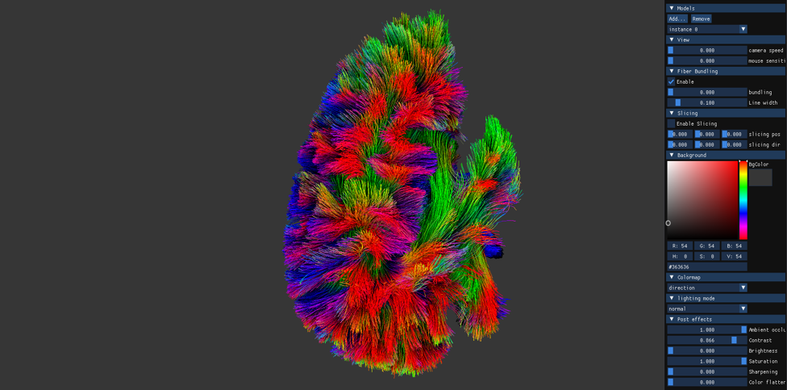

## FiberVisualizer
An intuitive and interactive OpengGL application for visualizing large-scale tractography dataset.

## System Requirement

- It’s highly recommended to run the application on a PC with a Windows system (actually we didn’t test it on any other OS).
- Make sure that you have a GPU enabled, with an appropriate version of GPU driver installed that supports OpenGL 4.3+.
- Make sure that you have at least 2.5 GB video memory available to enable fiber bundling.

## Features

- .tck loader
- Fiber bundling
- Slicing
- Color mapping
- Physically based material
- Screen space ambient occlusion
- A series of post-processing effects

## Run the Application

- Decompress `Release.zip` to some directory on your PC.
- Run the `FiberVisualization.exe` inside.

## Third party libraries
- GLM: https://github.com/g-truc/glm
- GLFW: https://www.glfw.org/
- GLAD: https://glad.dav1d.de/
- OpenGL 4.3: https://www.opengl.org/
- Dear ImGUI: https://github.com/ocornut/imgui

## Code References
- View controlling: https://learnopengl.com/Getting-started/Camera
- Shader compiler: https://learnopengl.com/Getting-started/Shaders
- Compute shader compiler: https://learnopengl.com/Guest-Articles/2022/Compute-Shaders/Introduction
- File browser: https://github.com/AirGuanZ/imgui-filebrowser
